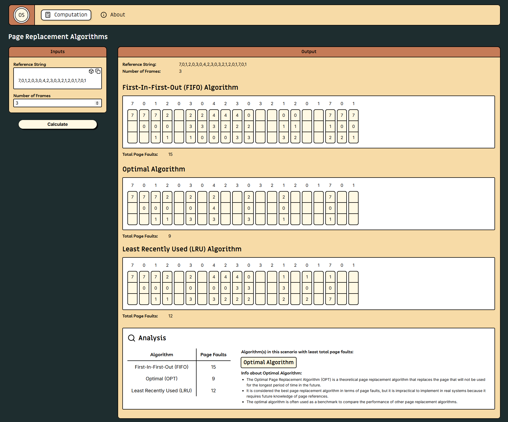
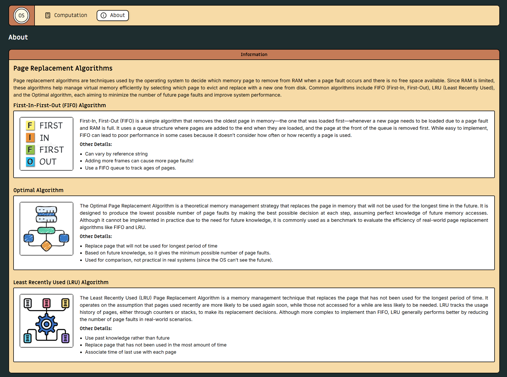

# Page Replacement Algorithms Visualizer

This project is a desktop application built for the Finals Case Study in Operating Systems. It visualizes the behavior of three Page Replacement Algorithms: **FIFO (First-In-First-Out)**, **Optimal**, and **LRU (Least Recently Used)**.

---

## Technologies Used

- **Electron**: For building the cross-platform desktop application.
- **React**: For creating the user interface.
- **TypeScript**: For type-safe development.
- **Webpack**: For bundling the application.
- **CSS**: For styling the application.

---

## App Installation

Go to the "Releases" section of this github repository located at the right side area. Look for the latest release, then under the "Assets" section, you can download the .exe setup file of the application.

---

## Project Structure

Below is the hierarchy of the project directory.

```plaintext
PageReplacementAlgorithms/
├── .erb/
├── CaseStudyDocuments/
├── assets/
├── release/
├── src/
│   ├── main/
│   ├── renderer/
│   ├── utils/
│   │   ├── constants/
│   │   ├── helpers/
└── └── └── workers/
```

### Directory Breakdown

`.erb/` - This directory contains all the compilation configurations, scripts, and webpack settings used by the application.

`assets/` - This directory contains static assets such as images, fonts, and type declarations.

`CaseStudyDocuments/` - This directory contains all the documents required for the case study.

`release/` - This directory contains the general app configurations for compilation

`src/` - This is the main source directory for the application. (All important source codes can be seen here)

- **`main/`**: Contains the backend logic for the Electron app, including the main process and utility scripts.

- **`renderer/`**: Contains all the React components and styles to render the user interface of the application.

- **`utils/`**: Contains the logic and scripts to implement the three page replacement algorithms.

  - **`constants/`**: Contains all the constant values that is used throughout the application

  - **`helpers/`**: **(CORE BACKEND LOGIC FOLDER)** Contains all the logic functions as well as the classes used to implement the different page replacement algorithms.

  - **`workers/`**: Contains all the scripts used to create separate threads for computation.

---

## Images




---

## License

This project is licensed under the GPL-3.0 license.

<br>&copy; 2025 Aron-Arboleda. All rights reserved.
