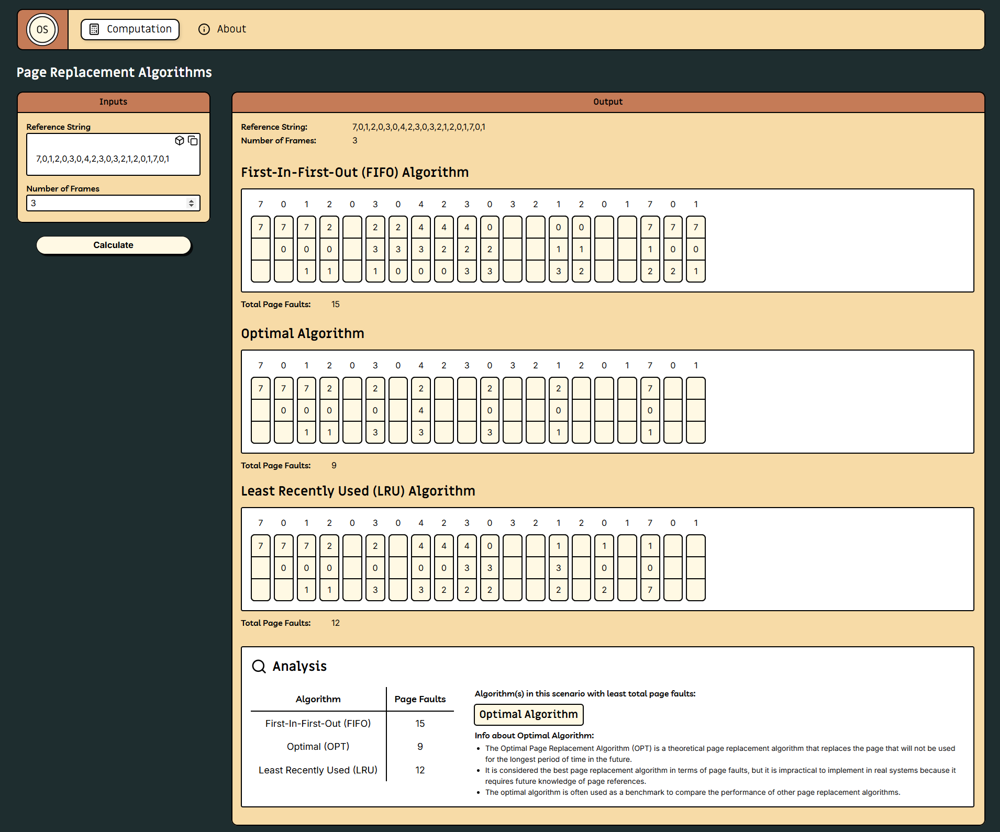
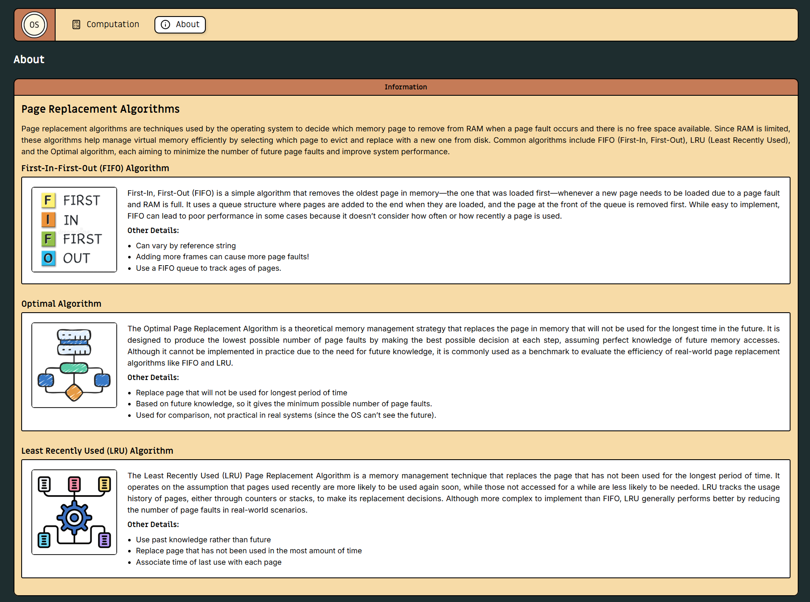

# Page Replacement Algorithms Visualizer

This project is a desktop application built for the Finals Case Study in Operating Systems. It visualizes the behavior of three Page Replacement Algorithms: **FIFO (First-In-First-Out)**, **Optimal**, and **LRU (Least Recently Used)**.

---

## Technologies Used

- **Tauri**: For building lightweight, secure, and cross-platform desktop applications using web technologies (like HTML, CSS, JavaScript) combined with a Rust backend.
- **Rust**: plays the backend/core role in a Tauri application, powering the native layer of the desktop app.
- **React**: For creating the user interface.
- **TypeScript**: For type-safe development.
- **CSS**: For styling the application.

---

## App Installation

Go to the "Releases" section of this github repository located at the right side area. Look for the latest release, then under the "Assets" section, you can download the .exe setup file of the application.

---

## Project Structure

Below is the hierarchy of the project directory that shows only the necessary files for the implementation of the page replacement algorithms.

```plaintext
PageReplacementAlgorithms/
├── CaseStudyDocuments/
└── src/
    └── utils/
        ├── constants/
        ├── helpers/
        └── workers/
```

### Directory Breakdown

- **`CaseStudyDocuments/`**: - This directory contains all the documents required for the case study.

- **`src/`**: - This is the main source directory for the application. (All important source codes can be seen here)

  - **`utils/`**: Contains the logic and scripts to implement the three page replacement algorithms.

    - **`constants/`**: Contains all the constant values that is used throughout the application

    - **`helpers/`**: **(CORE BACKEND LOGIC FOLDER)** Contains all the logic functions as well as the classes used to implement the different page replacement algorithms.

    - **`workers/`**: Contains all the scripts used to create separate threads for computation.

- **Other files and directories are from the [tauri-react code template](https://github.com/elibroftw/modern-desktop-app-template)**

---

## Images




---

## Credits

This project used a tauri-react boilerplate: [modern-desktop-app-template](https://github.com/elibroftw/modern-desktop-app-template)

## License

This project is licensed under the GPL-3.0 license.

<br>&copy; 2025 Aron-Arboleda. All rights reserved.
